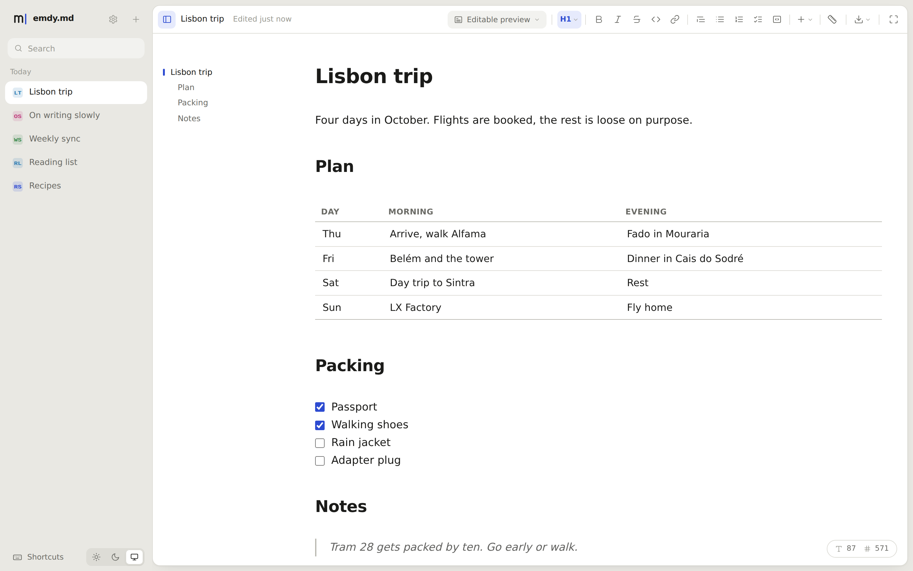
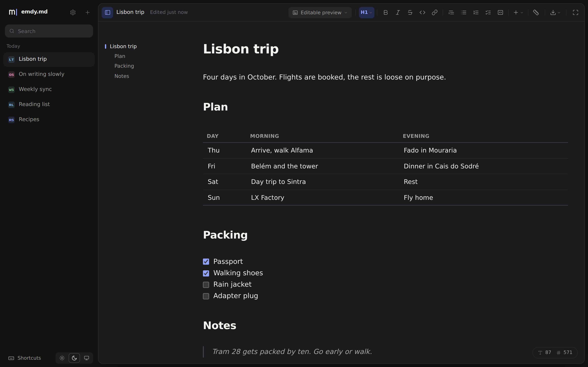
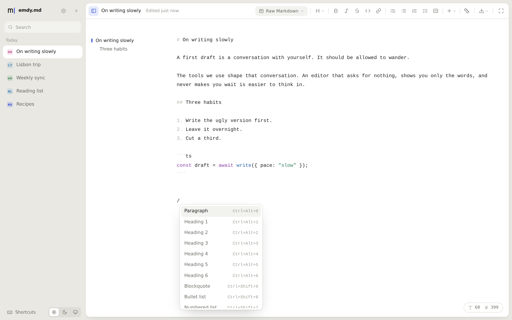
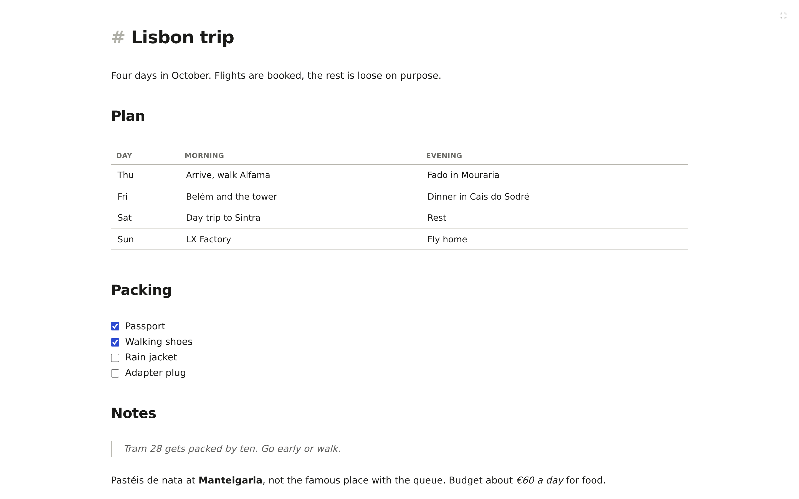

<div align="center">

<a href="https://emdy.md"></a>

# emdy.md

**A beautiful, local-first Markdown editor that runs entirely in your browser.**

No account, no server, no tracking. Your documents are plain `.md` files stored on your device.

[](https://github.com/imabdulazeez/emdy.md/actions/workflows/ci.yml)
[](LICENSE)
[](https://www.solidjs.com)
[](https://www.typescriptlang.org)
[](#-privacy)
[](#-contributing)

[**Try it at emdy.md**](https://emdy.md) · [Features](#-features) · [Privacy](#-privacy) · [Development](#%EF%B8%8F-development) · [Deploying](#-building-and-deploying)

<br>



</div>

## ✨ Features

- ✍️ **Two ways to write.** Raw Markdown, or an editable preview that formats as you type.
- 🧩 **Rich Markdown.** Tables, task lists, footnotes, and syntax-highlighted code blocks.
- 🧭 **Outline.** Every document's headings, shown beside the page.
- ⚡ **Composer menus.** Type `/` for blocks and `@` for dates, headings, and links to other documents.
- 🔗 **Linked documents.** Links between documents stay correct when you rename one.
- 🎯 **Focus mode.** Hides everything except the page.
- 🎨 **Themes.** Light and dark modes, six colour themes, and a choice of document font.
- 📤 **Export.** Save a document as Markdown, Word, or PDF.
- 📦 **Portable library.** Export every document to one file and import it in another browser.
- ⌨️ **Keyboard first.** Every action has a shortcut. Press `Ctrl+/` (`Cmd+/` on macOS) to see them.

## 📸 Screenshots

<table>
  <tr>
    <td width="50%"></td>
    <td width="50%"></td>
  </tr>
  <tr>
    <td align="center">Dark mode</td>
    <td align="center">Block menu</td>
  </tr>
  <tr>
    <td colspan="2"></td>
  </tr>
  <tr>
    <td colspan="2" align="center">Focus mode</td>
  </tr>
</table>

## 🔒 Privacy

Everything happens on your device. Documents live in the browser's [Origin Private File System](https://developer.mozilla.org/en-US/docs/Web/API/File_System_API/Origin_private_file_system) and settings live in local storage. The app makes no network requests after it loads, and document routes use the URL fragment, so the host only ever sees a request for `/`.

> [!NOTE]
> Browser storage belongs to one browser on one site. To move your documents, use **Export all documents** and **Import documents** in settings.

## 🛠️ Development

**Prerequisites:** the [Vite+](https://viteplus.dev) global CLI, which manages Node 24 and pnpm for you:

```bash
curl -fsSL https://vite.plus | bash
```

On Windows, run `irm https://vite.plus/ps1 | iex` in PowerShell instead.

```bash
git clone https://github.com/imabdulazeez/emdy.md.git
cd emdy.md
vp install
vp dev
```

### Checks and tests

Run the checks and unit tests before sending a change:

```bash
vp check   # format, lint, and type check
vp test    # unit and component tests
```

The browser tests use Playwright:

```bash
vp exec playwright install chromium
vp run test:browser
```

### Tech stack

| Area      | Choice                                                                            |
| --------- | --------------------------------------------------------------------------------- |
| UI        | [Solid 2](https://www.solidjs.com) with [Solidcn](https://solidcn.dev) primitives |
| Editor    | [CodeMirror 6](https://codemirror.net)                                            |
| Styling   | [Tailwind CSS v4](https://tailwindcss.com) with theme tokens                      |
| Toolchain | [Vite+](https://viteplus.dev)                                                     |
| Testing   | Vitest, Solid Testing Library, and [Playwright](https://playwright.dev)           |
| Hosting   | Static files on [Cloudflare Workers](https://workers.cloudflare.com)              |

## 🚀 Building and deploying

```bash
vp build
vp preview
```

The output in `dist` is a static site and can be served from any static host.

The live site runs on Cloudflare Workers, which serve only the files in `dist`. To deploy your own copy:

1. Add your domain as a zone in Cloudflare and update the routes in `wrangler.jsonc` to match.
2. Sign in with `vp exec wrangler login`.
3. Run `vp run deploy`.

## 🤝 Contributing

Issues and pull requests are welcome. Start with [CONTRIBUTING.md](CONTRIBUTING.md), then read [AGENTS.md](AGENTS.md) for the project's conventions on design, storage, shortcuts, and testing, and make sure `vp check` and `vp test` pass before opening a pull request.

## 📄 License

Released under the [MIT License](LICENSE).
